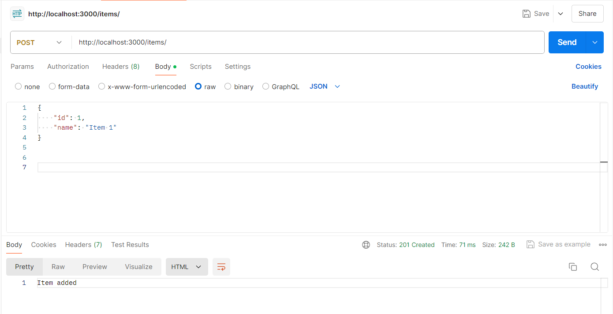
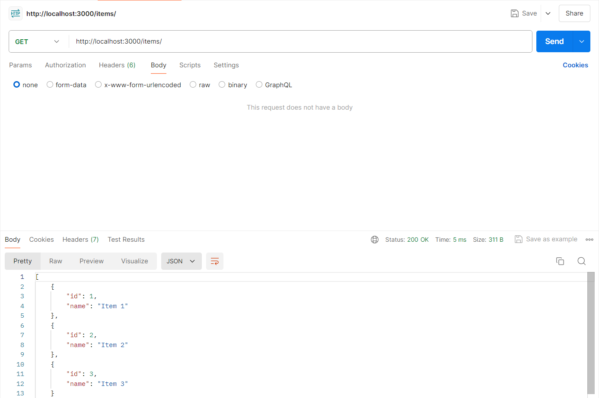
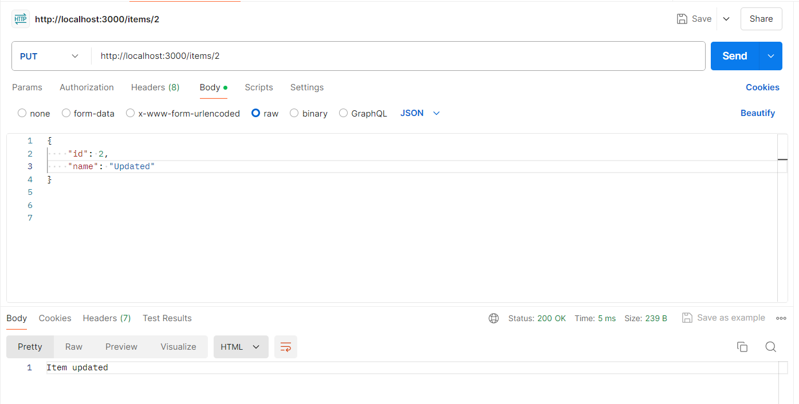
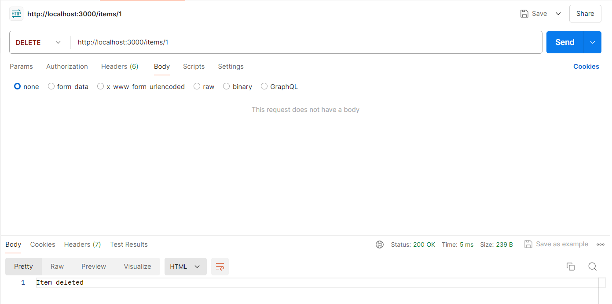

# Report: Express.js CRUD Application

## 1. What is Express.js?

Express.js is a fast, minimalist web framework for Node.js that simplifies building web applications and APIs. It provides a robust set of features for web and mobile applications, such as handling HTTP requests, middleware, routing, and more. Express is designed to be lightweight, allowing developers to integrate additional libraries as needed.

## 2. Middlewares in Express.js

Middlewares are functions that have access to the request (req), response (res), and the next function in the application's request-response cycle. They can modify the request and response objects, terminate the request-response cycle, or pass control to the next middleware function.

### Examples of Middlewares:

- `app.use(express.json())`: This middleware is used to parse incoming JSON payloads and make them available in the request body.
- `app.use((req, res, next) => { ... })`: This is a custom middleware that can be used for tasks like logging, authentication, or handling errors.

## 3. Implementation of CRUD Operations

### 3.1. POST Endpoint - Add an Item

The POST request adds an item to a local array. The item is sent in the request body as a JSON object.

```javascript
app.post('/items', (req, res) => {
    const item = req.body;
    items.push(item);
    res.status(201).send('Item added');
});
```
### 3.2. GET Endpoint - Retrieve All Items

This endpoint retrieves all items stored in the local array.

```javascript
app.get('/items', (req, res) => {
    res.json(items);
});
```
### 3.3. GET Endpoint by ID - Retrieve a Specific Item

This endpoint allows the retrieval of a specific item by its ID.

```javascript
app.get('/items/:id', (req, res) => {
    const id = parseInt(req.params.id);
    const item = items.find(i => i.id === id);
    if (item) {
        res.json(item);
    } else {
        res.status(404).send('Item not found');
    }
});
```
### 3.4. PUT Endpoint - Update an Item

This endpoint updates an existing item identified by its ID.

```javascript
app.put('/items/:id', (req, res) => {
    const id = parseInt(req.params.id);
    const index = items.findIndex(i => i.id === id);
    if (index !== -1) {
        items[index] = req.body;
        res.send('Item updated');
    } else {
        res.status(404).send('Item not found');
    }
});
```
### 3.5. DELETE Endpoint - Remove an Item

This endpoint deletes an item from the array by its ID.

```javascript
app.delete('/items/:id', (req, res) => {
    const id = parseInt(req.params.id);
    const index = items.findIndex(i => i.id === id);
    if (index !== -1) {
        items.splice(index, 1);
        res.send('Item deleted');
    } else {
        res.status(404).send('Item not found');
    }
});
```
## 4. Testing with Postman

 4.1. POST a new item: http://localhost:3000/items (with JSON body)

 

 4.2. GET all items: http://localhost:3000/items



 4.3. GET an item by ID: http://localhost:3000/items/+id


 4.4. PUT to update an item: http://localhost:3000/items/+id (with updated JSON body)



 4.5. DELETE an item by ID: http://localhost:3000/items/+id



## 5. Conclusion

In this project, we created a basic CRUD application using Express.js. We used middlewares for request parsing and implemented all four operations. Finally, we tested the application using Postman to verify the correct behavior of each endpoint.

